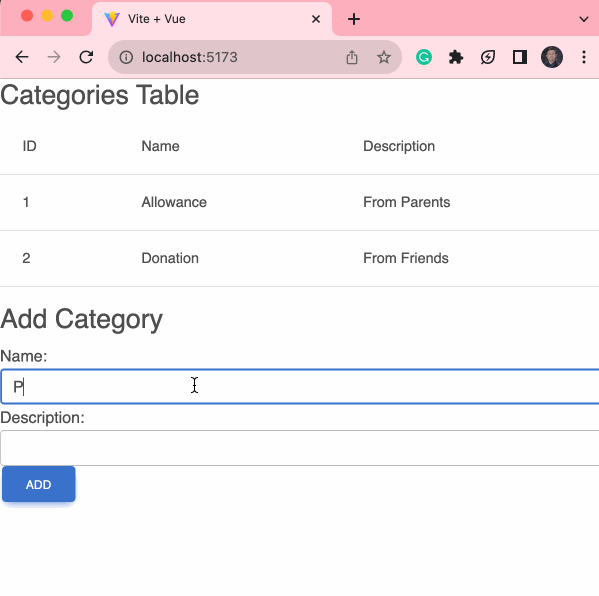

# vue-fintrack-1
 Vue implementation of Financial Tracker App

```bash
$ git clone https://github.com/cbatuic/vue-fintrack-1.git
$ cd vue-fintrack-1
$ npm install
$ npm run dev
```

### Code Snippets
This code displays tabular data in ```Vue JS```.
```html
<table class="table table-striped">
    <thead>
    <tr>
        <th>ID</th>
        <th>Name</th>
        <th>Description</th>
    </tr>
    </thead>
    <tbody>
    <tr v-for="category in categories" :key="category.id">
        <td>{{ category.id }}</td>
        <td>{{ category.name }}</td>
        <td>{{ category.description }}</td>
    </tr>
    </tbody>
</table>
```
> ```<table class="table table-striped">```: This creates an HTML table with the Bootstrap class "table" and "table-striped," which gives the table a striped appearance for better readability.

> ```<thead>```: This section contains the table header, where column headings are defined.

> ```<tr>```: Defines a table row within the table header.

> ```<th>ID</th>```: Defines a table header cell with the text "ID." This is typically the header for the first column.

> ```<th>Name</th>```: Defines a table header cell with the text "Name." This is typically the header for the second column.

> ```<th>Description</th>```: Defines a table header cell with the text "Description." This is typically the header for the third column.

> ```<tbody>```: This section contains the table body, where the actual data is displayed.

> ```<tr v-for="category in categories" :key="category.id">```: This is a Vue.js directive that iterates over the "categories" array and generates a table row for each category. The v-for directive loops through each item in the "categories" array, and :key assigns a unique identifier to each row based on the category's ID.

> ```<td>{{ category.id }}</td>```: Defines a table cell within the row, displaying the category's ID.

> ```<td>{{ category.name }}</td>```: Defines a table cell displaying the category's name.

> ```<td>{{ category.description }}</td>```: Defines a table cell displaying the category's description.
</p>

```js
import { ref } from 'vue';

const categories = ref([
  { id: 1, name: "Allowance", description: "From Parents" },
  { id: 2, name: "Donation", description: "From Friends" },
]);
```

> ```import { ref } from 'vue';```: This line imports the ref function from the Vue.js library. ref is used to create reactive variables in Vue.js that can be bound to the user interface.

> ```const categories = ref([ ... ]);```: This line defines a reactive variable named "categories" using the ref function. It initializes the variable with an array of category objects. Each category object represents an item in a list and includes three properties: "id," "name," and "description." This array of categories can be dynamically updated, and changes will trigger reactivity in the user interface.

In summary, this code sets up a ```reactive variable``` called "categories" that contains an array of category objects. These categories can be used in a Vue.js component to display or manipulate data, and any changes to the "categories" variable will automatically update the associated UI elements.

```js
const addCategory = () => {
  if (newCategory.value.name && newCategory.value.description) {
    const newId = categories.value.length > 0 ? Math.max(...categories.value.map((c) => c.id)) + 1 : 1;
    categories.value.push({ id: newId, ...newCategory.value });
    newCategory.value = { name: "", description: "" };
  }
}
```

> ```const addCategory = () => {```: This line defines a function named "addCategory" using an arrow function syntax.

> ```if (newCategory.value.name && newCategory.value.description) {```: This is a conditional statement that checks if both the "name" and "description" properties of the "newCategory" object have values. It ensures that both fields are filled out before proceeding.

> ```const newId = categories.value.length > 0 ? Math.max(...categories.value.map((c) => c.id)) + 1 : 1;```: This line calculates a new unique ID for the category being added. It checks if there are existing categories (the length of the "categories" array) and, if so, finds the maximum ID among the existing categories and increments it by 1. If there are no existing categories, it sets the ID to 1.

> ```categories.value.push({ id: newId, ...newCategory.value });```: This line adds a new category to the "categories" array. The new category object includes an "id" property with the calculated "newId" and copies the "name" and "description" properties from the "newCategory" object. This updates the list of categories with the new category.

```newCategory.value = { name: "", description: "" };```: After adding the new category, this line resets the "newCategory" object to clear the "name" and "description" fields, preparing it for adding another category.

In summary, this code defines a ***function to add a new category to a list of categories***. It ```checks``` for valid input, generates a unique ID, ```appends``` the new category to the list, and ```clears``` the input fields for further additions.

### Preview



### Challenge

1. Create an ```Edit``` functional component which includes user interface to modify **name** and **description** properties.
2. Update the ```Table``` once the changes are saved.
3. Create a ```categories.json``` data and use ```axios``` to perform ```GET``` and ```PUT``` requests.


